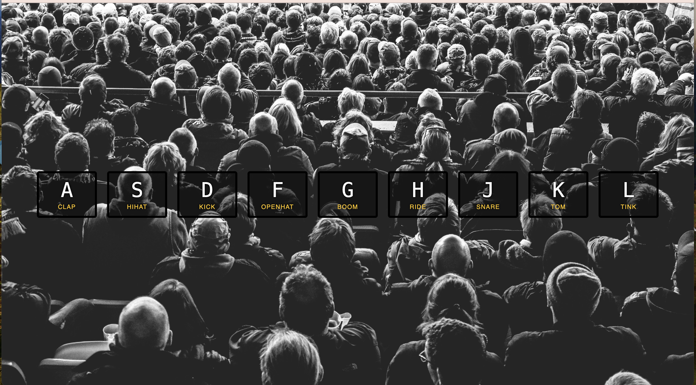

# js30

This is a 30-days javascript grinding  
1.drum-kit: [https://github.com/ningh98/js30]  
2.clock: [https://github.com/ningh98/js30_CSS-JS_Clock]  
3. CSS variable with JS [https://github.com/ningh98/CSS_variable_with_JS]  
4. js array practice [https://github.com/ningh98/js_array]  
5. Flex Panels Image Gallery [https://github.com/ningh98/flex_gallery]  
6. Ajax type ahead [https://github.com/ningh98/ajax_type_ahead]  
7. js array practice 2 [https://github.com/ningh98/js_array2]  
8. html canvas [https://github.com/ningh98/HTML_canvas]  
9. js dev tool tips [https://github.com/ningh98/js_dev_tool_tips]  
10. Hold_Shift_Check_Checkboxes [https://github.com/ningh98/Hold_Shift_Check_Checkboxes]  
11. Custome_video_player [https://github.com/ningh98/custome_video_player]  
12. Key Sequence Detection [https://github.com/ningh98/key_sequence_detection]  
13. Slide in on Scroll [https://github.com/ningh98/slide_in_on_scroll]  
14. Object and Arrays -- reference vs copy[https://github.com/ningh98/ObjectAndArrays-reference_vs_copy]  
15. LocalStorage_and_EventDelegation [https://github.com/ningh98/LocalStorage_and_EventDelegation]  
16. Mouse move shadow [https://github.com/ningh98/Mouse_move_shadow]  
17. Sort without articles [https://github.com/ningh98/sort_without_articles]  
18. Adding_up_times_with_reduce [https://github.com/ningh98/Adding_up_times_with_reduce]  
19. Webcame [https://github.com/ningh98/webcam]  
20. speech detection [https://github.com/ningh98/speech_detection]  
21. Geolocation_based_Speedometer_and_Compass [https://github.com/ningh98/Geolocation_based_Speedometer_and_Compass]  
22. Follow_along_links [https://github.com/ningh98/Follow_along_links]  
23. Speech_Synthesis [https://github.com/ningh98/Speech_Synthesis]  
24. sticky_nav [https://github.com/ningh98/sticky_nav]  
25. Event-Capture-Propagation-Bubbling-and-Once [https://github.com/ningh98/Event-Capture-Propagation-Bubbling-and-Once]  
26. Stripe-Follow-Along-Nav [https://github.com/ningh98/Stripe-Follow-Along-Nav]  
27. Click-and-Drag [https://github.com/ningh98/Click-and-Drag]  
28. Video-speed-controller [https://github.com/ningh98/Video-speed-controller]

## Table of contents

- [Overview](#overview)
  - [Screenshot](#screenshot)
  - [Links](#links)
- [My process](#my-process)
  - [Built with](#built-with)
  - [What I learned](#what-i-learned)
  - [Useful resources](#useful-resources)


## Overview

This project implements an interactive drum kit using HTML, CSS, and JavaScript. The goal is to create a web application where users can play different drum sounds by pressing specific keys on their keyboard.

### Screenshot



### Links

- Live Site URL: [https://ningh98.github.io/js30/]

## My process

### Built with

- HTML
- CSS
- Javascript


### What I learned


```html
<div data-key="65" class="key">
      <kbd>A</kbd>
      <span class="sound">clap</span>
</div>
```
kbd represents a span of inline text denoting textual user input from a keyboard, voice input, or any other text entry device.

to use made up html attribute, for example data-key here, you just have to prefix them with data-

```css
.key {
  transition: all .07s ease;
}
```
look it up on mdn

```js
const removeTransition = (e) => {
    if(e.propertyName !== 'transform') return; 
    
    e.target.classList.remove('playing');
}

const keys = document.querySelectorAll('.key')
keys.forEach(key => key.addEventListener('transitionend', removeTransition))
```
transitionend event


### Useful resources

- [keycode.info]    press key to see keycode

