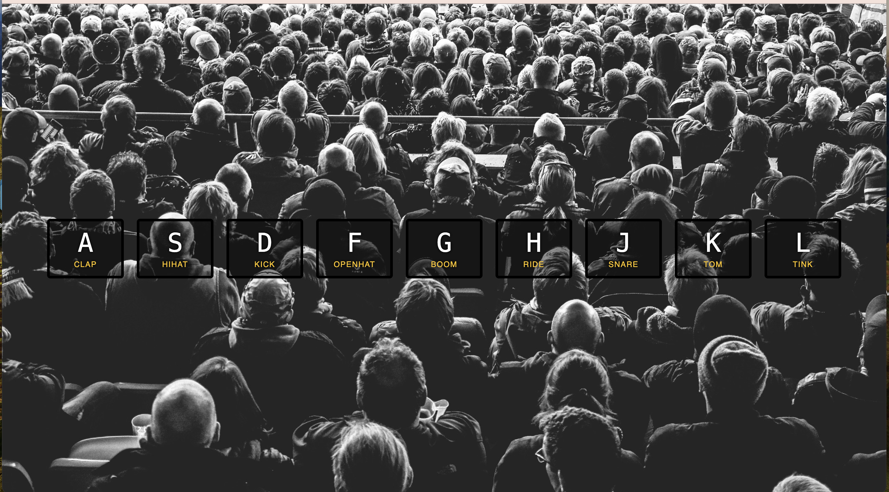

# js30


This is a 30-days javascript grinding

## Table of contents

- [Overview](#overview)
  - [Screenshot](#screenshot)
  - [Links](#links)
- [My process](#my-process)
  - [Built with](#built-with)
  - [What I learned](#what-i-learned)
  - [Useful resources](#useful-resources)


## Overview

This project implements an interactive drum kit using HTML, CSS, and JavaScript. The goal is to create a web application where users can play different drum sounds by pressing specific keys on their keyboard.

### Screenshot



### Links

- Solution URL: [Add solution URL here](https://your-solution-url.com)
- Live Site URL: [Add live site URL here](https://your-live-site-url.com)

## My process

### Built with

- HTML
- CSS
- Javascript
- CSS Grid


### What I learned


To see how you can add code snippets, see below:

```html
<div data-key="65" class="key">
      <kbd>A</kbd>
      <span class="sound">clap</span>
</div>
```
kbd represents a span of inline text denoting textual user input from a keyboard, voice input, or any other text entry device.

to use made up html attribute, for example data-key here, you just have to prefix them with data-

```css
.key {
  transition: all .07s ease;
}
```
look it up on mdn

```js
const removeTransition = (e) => {
    if(e.propertyName !== 'transform') return; 
    
    e.target.classList.remove('playing');
}

const keys = document.querySelectorAll('.key')
keys.forEach(key => key.addEventListener('transitionend', removeTransition))
```
transitionend event


### Useful resources

- [keycode.info]    press key to see keycode

